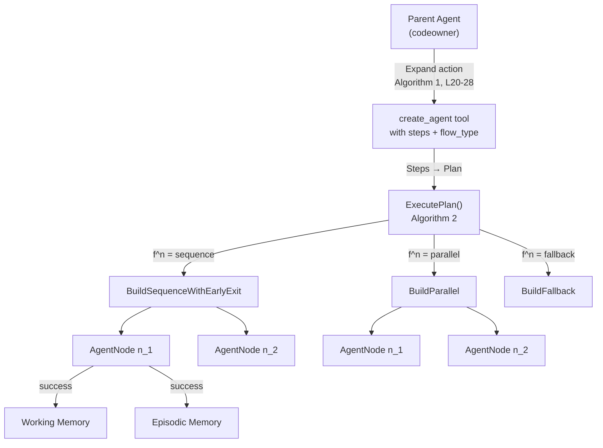

# ReAcTree Orchestrator Architecture

> Implementation of [ReAcTree: Agent Tree for Hierarchical Task Decomposition](https://arxiv.org/abs/2511.02424) in `pkg/reactree`.

## Paper → Code Mapping



| Paper Concept | Code Location | Notes |
|---|---|---|
| Agent node `n_i` with subgoal `g_i^n` | [PlanStep](./pkg/reactree/orchestrator.go#L48) | Goal, Tools, TaskType |
| Control flow type `f^n` | [Plan.Flow](./pkg/reactree/orchestrator.go#L34) | sequence / parallel / fallback |
| Expand action `a_t^n = (f^n, [g_1..g_K])` | [executePlan](./pkg/reactree/create_agent.go#L416) | Converts CreateAgentRequest → Plan |
| Algorithm 2 (ExecCtrlFlowNode) | [ExecutePlan](./pkg/reactree/orchestrator.go#L99) | Builds StateGraph, runs nodes |
| Working memory (obs. blackboard) | [memory.WorkingMemory](./pkg/reactree/memory) | Shared across all nodes |
| Episodic memory (experience store) | [memory.EpisodicMemory](./pkg/reactree/memory/episodic.go) | Goal-keyed episode retrieval |
| LLM policy `p_LLM(·)` | [expert.Expert](./pkg/expert/expert.go) | Shared across plan nodes |
| Action space `A_t^n` | [selectStepTools](./pkg/reactree/orchestrator.go#L395) | Strips send_message, create_agent |
| Max decisions `D_max` | `OrchestratorConfig.MaxDecisions` | Capped at 15 |

---

## Implementation Phases

### Phase 1: Sub-Agent Isolation

**Problem**: Sub-agents could call `send_message` directly, causing message flooding (the "meal plan bug" — each LLM iteration inside a sub-agent fires `send_message`, producing N copies of content).

**Root cause**: No framework-level enforcement. The LLM could ignore prompt instructions and call `send_message` anyway.

**Fix**:
- [create_agent.go L181-186](./pkg/reactree/create_agent.go#L181): `send_message` stripped from sub-agent tool sets at framework level, regardless of what the LLM requests
- [messenger_tool.go](./pkg/messenger/messenger_tool.go): 2-minute `ContentCooldown` after content delivery as safety net
- Sub-agent results stored in working memory under `subagent:<name>:result`

### Phase 2: Orchestrator Planning

**Problem**: Flat sub-agent spawning (one goal → one agent) can't express dependent multi-step tasks or parallel independent tasks.

**Root cause**: `create_agent` only supported single-goal execution. No way to express "do A then B" or "do A and B simultaneously".

**Fix**:
- [orchestrator.go](./pkg/reactree/orchestrator.go): `Plan` struct with `Steps` and `Flow`, `ExecutePlan()` builds a `StateGraph`
- [create_agent.go](./pkg/reactree/create_agent.go): Extended `CreateAgentRequest` with `steps` and `flow_type` JSON fields

### Phase 3: Episodic Memory Integration

**Problem**: Each sub-agent starts from scratch with no knowledge of past similar tasks.

**Root cause**: No feedback loop from successful executions back to the agent's context.

**Fix**:
- Successful sub-agent and plan step results stored as `Episode` objects via `EpisodicMemory.Store()`
- `NewAgentNodeFunc` retrieves similar episodes via `EpisodicMemory.Retrieve()` and injects them into the prompt

---

## Bugs Found & Fixed

### Bug 1: HITL Bypass in Orchestrator (Critical)

**Problem**: Single sub-agents get tools wrapped with HITL approval at [create_agent.go L204](./pkg/reactree/create_agent.go#L204). But `orchestrator.go`'s `selectStepTools()` pulled tools directly from the registry **without wrapping**. Plan step agents bypassed human approval for write tools (`run_shell`, `save_file`).

**Why this happens**: `selectStepTools` was designed as a pure filtering function. The HITL wrapping was a per-request concern that lived in `execute()`, not in the orchestrator.

**Fix**: Added `ToolWrapSvc` and `WrapRequest` to [OrchestratorConfig](./pkg/reactree/orchestrator.go#L67). Tools are wrapped after selection at [orchestrator.go L131-133](./pkg/reactree/orchestrator.go#L131).

**Potential regression**: If new tool-wrapping concerns are added to the single sub-agent path, they must also be added to the orchestrator config. Consider extracting a shared `wrapToolsForSubAgent()` function.

---

### Bug 2: Parallel Graph Wiring Conflict (Crash Risk)

**Problem**: For parallel flow, `SetEntryPoint(nodeIDs[0])` wired `Start → nodeIDs[0]`, then `AddEdge(Start, allNodes)` added edges from Start to ALL nodes. This created conflicting/duplicate edges that could panic or compile-error in the graph library.

**Why this happens**: `SetEntryPoint` was called unconditionally before the flow-type switch, but parallel flow needs fan-out from Start to ALL nodes, not just the first.

**Fix**: Moved `SetEntryPoint` inside each flow-type case. Parallel flow uses only `AddEdge(graph.Start, id)` without `SetEntryPoint`. See [orchestrator.go L172-196](./pkg/reactree/orchestrator.go#L172).

**Potential regression**: If new flow types are added, they must manage their own entry point wiring.

---

### Bug 3: No Timeout on Plan Execution (Hang Risk)

**Problem**: Single sub-agents get a 2-minute timeout ([create_agent.go L326](./pkg/reactree/create_agent.go#L326)). `ExecutePlan` had **no** timeout. A stuck plan step would hang the parent agent indefinitely.

**Why this happens**: `ExecutePlan` was added as a new code path that didn't inherit the timeout pattern from the existing single-agent path.

**Fix**: Added `context.WithTimeout(ctx, timeout)` with a 3-minute default at [orchestrator.go L95-101](./pkg/reactree/orchestrator.go#L95). Configurable via `OrchestratorConfig.Timeout`.

**Potential regression**: Multi-step plans with many sequential steps may legitimately need more than 3 minutes. The timeout should be proportional to step count.

---

### Bug 4: Shared Expert Across Parallel Nodes (Thread Safety)

**Problem**: All parallel plan step nodes share the same `cfg.Expert` instance. If `Expert.Do()` isn't goroutine-safe, parallel execution could corrupt state.

**Why this happens**: `Expert` is an interface — the caller doesn't know the implementation's thread safety guarantees.

**Assessment**: After reviewing `expert.go`, `Expert.Do()` calls `getRunner()` which creates a fresh `runner.Runner` per request. The `runner.Runner` creates a new session per call. So concurrent calls to `Expert.Do()` are safe because they don't share mutable state.

**Workaround**: Documented in [OrchestratorConfig.Expert godoc](./pkg/reactree/orchestrator.go#L71). If a future Expert implementation is NOT thread-safe, each parallel node would need its own instance via `ExpertBio.ToExpert()`.

---

### Bug 5: Pre-existing Tool Selection Bug (Logic Error)

**Problem**: In [create_agent.go L148-154](./pkg/reactree/create_agent.go#L148), `create_agent` was appended to `selectedTools` **before** the `continue` check. The tool got added to the sub-agent; the `continue` skipped nothing useful.

```diff
-for _, name := range req.ToolNames {
-    if tl, ok := t.toolRegistry[name]; ok {
-        selectedTools = append(selectedTools, tl)  // appended FIRST
-        if name == "create_agent" {
-            continue  // too late, already in the slice
-        }
-    }
-}
+for _, name := range req.ToolNames {
+    if name == "create_agent" {
+        continue  // skip BEFORE append
+    }
+    if tl, ok := t.toolRegistry[name]; ok {
+        selectedTools = append(selectedTools, tl)
+    }
+}
```

**Why this happens**: The original code was likely a copy-paste from the `name == "send_message"` pattern at L141-144, which uses a reverse-iteration loop and correctly removes after append.

**Fix**: Moved the check before the append.

---

### Bug 6: Episodes Always Stored as Success (Data Pollution)

**Problem**: Episodes were stored as `EpisodeSuccess` unconditionally, even when the sub-agent or plan step actually failed. This pollutes episodic memory with failed trajectories labeled as successes, causing future agents to retrieve bad examples.

**Why this happens**: The initial implementation checked `result != ""` as the only guard, assuming non-empty output means success. But failed nodes can produce error output.

**Fix**: Added `nodeStatus == Success` guard in both the multi-step wrapper ([orchestrator.go L173](./pkg/reactree/orchestrator.go#L173)) and single-step path ([orchestrator.go L321](./pkg/reactree/orchestrator.go#L321)).

---

## Test Coverage Gaps

### What IS Tested

| Area | Test File | Description |
|---|---|---|
| `selectStepTools` | [orchestrator_test.go](./pkg/reactree/orchestrator_test.go) | 8 specs: tool filtering invariants |
| `ExecutePlan` preconditions | orchestrator_test.go | 2 specs: empty plan, Plan struct shape |
| Episodic memory guards | orchestrator_test.go | 2 specs: store on Success, skip on Failure |
| Control flow builders | [control_flow_test.go](./pkg/reactree/control_flow_test.go) | 17 specs: Sequence, Fallback, Parallel, schema |

### What is NOT Tested (Integration Gaps)

| Gap | Risk | Workaround |
|---|---|---|
| **`ExecutePlan` end-to-end with FakeExpert** | Core graph-build → run → collect pipeline untested | Create a test that calls `ExecutePlan` with a `FakeExpert` returning canned responses, verify `OrchestratorResult.Outputs` |
| **Parallel graph compilation** | The fix for Bug #2 is untested | Build a parallel Plan with 2+ steps, verify `sg.Compile()` succeeds and executor runs without panic |
| **Timeout propagation** | Context cancellation may not propagate through graph executor | Call `ExecutePlan` with a 1ms timeout, verify it returns error or partial result |
| **HITL wrapping verification** | Tools may not actually get wrapped | Pass a mock `ToolWrapSvc` that records wrap calls, verify it's called for each step's tools |
| **Episode truncation at 500 chars** | Long trajectories may not get truncated | Store a 1000-char output, verify the stored episode trajectory is ≤500 chars |
| **`executePlan` bridge (create_agent.go)** | `Steps`/`Flow` → `Plan` conversion untested | Call `executePlan` with a mock request, verify Plan fields match |
| **Working memory storage per step** | Step outputs may not appear under `plan_step:<name>:result` | Run ExecutePlan with WM, query WM for expected keys after completion |
| **`joinStepGoals` helper** | Composite goal string may be malformed | Unit test with 0, 1, 3 steps |

### Recommended Test Priority

1. **`ExecutePlan` with FakeExpert** — highest value, covers the most code paths
2. **Parallel graph compilation** — validates Bug #2 fix
3. **Timeout propagation** — validates Bug #3 fix
4. **Working memory storage** — validates data flow between steps

---

## File Reference

| File | Role |
|---|---|
| [orchestrator.go](./pkg/reactree/orchestrator.go) | Plan, PlanStep, OrchestratorConfig, ExecutePlan |
| [create_agent.go](./pkg/reactree/create_agent.go) | CreateAgentRequest (Steps, Flow), executePlan bridge |
| [agent_node.go](./pkg/reactree/agent_node.go) | NewAgentNodeFunc — expert call + episodic retrieval |
| [control_flow.go](./pkg/reactree/control_flow.go) | BuildSequence, BuildParallel, BuildFallback |
| [memory/episodic.go](./pkg/reactree/memory/episodic.go) | Episode, EpisodicMemory interface |
| [memory/working.go](./pkg/reactree/memory) | WorkingMemory shared blackboard |
| [codeowner/expert.go](./pkg/codeowner/expert.go) | Wires expert + episodic into createAgentTool |
| [orchestrator_test.go](./pkg/reactree/orchestrator_test.go) | 17 paper-mapped unit tests |
