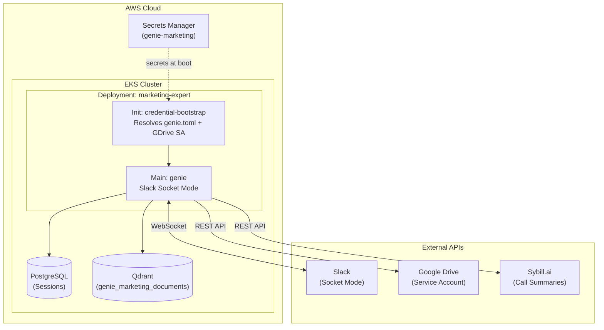

# Marketing Expert — Genie Agent

A Slack-native marketing intelligence agent powered by Genie. It reads Google Drive documents, queries Sybill.ai for sales intelligence, and surfaces insights directly in Slack threads.

## Architecture



## Prerequisites

- An existing EKS cluster with an OIDC provider
- Qdrant vector store deployed (shared with devops-copilot)
- `kubectl` access configured
- Terraform ≥ 1.5

## Google Drive Setup (Service Account)

The agent uses a **GCP Service Account** to access Google Drive — no interactive OAuth flow required.

### 1. Create the Service Account

1. Go to [Google Cloud Console → IAM & Admin → Service Accounts](https://console.cloud.google.com/iam-admin/serviceaccounts)
2. Click **Create Service Account**
   - Name: `genie-marketing-reader` (or similar)
   - Click **Create and Continue**, then **Done**
3. Click on the service account → **Keys** tab → **Add Key → Create new key → JSON**
4. Save the downloaded JSON file

### 2. Enable the Drive API

Go to [APIs & Services → Enable APIs](https://console.cloud.google.com/apis/library) → search **Google Drive API** → **Enable**

### 3. Share Folders with the Service Account

1. Copy the service account email (e.g. `genie-marketing-reader@your-project.iam.gserviceaccount.com`)
2. In Google Drive, right-click the folder(s) you want the agent to read → **Share** → paste the SA email → **Viewer** role
3. Copy the folder IDs from the URL (the long string after `/folders/`)

### 4. Store the SA Key in Secrets Manager

Add the Service Account JSON as a string value in your AWS Secrets Manager secret under the key `GDRIVE_SA_JSON`:

```bash
# Read your existing secret, add GDRIVE_SA_JSON, and update
aws secretsmanager get-secret-value \
  --secret-id dev/genie/marketing \
  --query SecretString --output text | \
  jq --arg sa "$(cat path/to/your-sa-key.json)" '. + {GDRIVE_SA_JSON: $sa}' | \
  aws secretsmanager put-secret-value \
    --secret-id dev/genie/marketing \
    --secret-string file:///dev/stdin
```

### 5. Configure Terraform

In `dev.auto.tfvars`, set the `gdrive_credentials_secret_path` field:

```hcl
aws = {
  region                         = "us-west-2"
  eks_cluster_name               = "developer-eks"
  secrets_manager_arn            = "arn:aws:secretsmanager:us-west-2:123456789:secret:dev/genie/marketing"
  secrets_manager_name           = "dev/genie/marketing"
  gdrive_credentials_secret_path = "GDRIVE_SA_JSON"  # ← enables GDrive SA
}
```

### 6. Add Folder IDs

In `genie.toml.tftpl` (or `genie.local.toml` for local dev), add your Google Drive folder IDs:

```toml
[data_sources.gdrive]
enabled = true
folder_ids = ["1ABC...", "1DEF..."]  # Your shared folder IDs
```

## Other Secrets Required

Store these in the same Secrets Manager secret (`dev/genie/marketing`):

| Key | Description |
|-----|-------------|
| `OPENAI_API_KEY` | OpenAI API key (embeddings + models) |
| `ANTHROPIC_API_KEY` | Anthropic API key (Claude models) |
| `GEMINI_API_KEY` | Google Gemini API key |
| `SLACK_APP_TOKEN` | Slack app-level token (`xapp-...`) |
| `SLACK_BOT_TOKEN` | Slack bot token (`xoxb-...`) |
| `SYBILL_API_KEY` | Sybill.ai API key |
| `LANGFUSE_PUBLIC_KEY` | Langfuse public key (observability) |
| `LANGFUSE_SECRET_KEY` | Langfuse secret key |
| `LANGFUSE_HOST` | Langfuse host URL |
| `GDRIVE_SA_JSON` | GCP Service Account JSON (optional) |

## Deploy

```bash
terraform init
terraform plan
terraform apply
```

## Local Development

```bash
# Set required env vars (see genie.local.toml for the full list)
export SLACK_APP_TOKEN=xapp-...
export SLACK_BOT_TOKEN=xoxb-...
export GOOGLE_APPLICATION_CREDENTIALS=path/to/sa-key.json  # GDrive SA
# ... other keys

./run-local.sh
```

For local dev, `GOOGLE_APPLICATION_CREDENTIALS` env var is the simplest way to authenticate — Genie's Drive wrapper auto-detects Service Account JSON.
