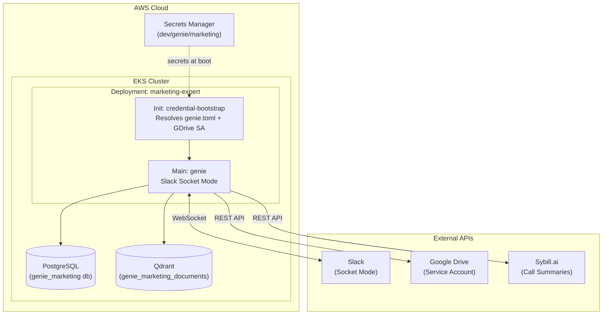

# Marketing Expert — Genie Agent

A Slack-native marketing intelligence agent powered by Genie. It reads Google Drive documents, queries Sybill.ai for sales intelligence, and surfaces insights directly in Slack threads.

## Architecture

This agent is designed to run in an existing EKS cluster alongside a PostgreSQL instance (for session storage) and Qdrant (for vector search).



## Prerequisites

- An existing EKS cluster with an OIDC provider (for IAM Roles for Service Accounts)
- Prometheus metrics scraping configured in the cluster (optional but recommended)
- A shared PostgreSQL instance (e.g., deployed via the `devops-copilot` example)
- A shared Qdrant vector store (e.g., deployed via the `devops-copilot` example)
- `kubectl` access configured
- Terraform ≥ 1.5

## External Connections Setup

### 1. Slack App Setup

Create a Slack App with Socket Mode enabled and the following Scopes:

**Bot Token Scopes:**
- `app_mentions:read`
- `channels:history`
- `channels:read`
- `chat:write`
- `groups:history`
- `groups:read`
- `im:history`
- `im:read`
- `mpim:history`
- `mpim:read`
- `users:read`

**Event Subscriptions (Socket Mode):**
- `app_mention`
- `message.channels`
- `message.groups`
- `message.im`
- `message.mpim`

Collect the **Bot User OAuth Token** (`xoxb-...`) and **App-Level Token** (`xapp-...`).

### 2. Google Drive Setup (Service Account)

The agent uses a **GCP Service Account** to access Google Drive without interactive OAuth.

1. Go to [Google Cloud Console → IAM & Admin → Service Accounts](https://console.cloud.google.com/iam-admin/serviceaccounts)
2. Click **Create Service Account** (e.g., `genie-marketing-reader`)
3. Click on the service account → **Keys** tab → **Add Key → Create new key → JSON**
4. Save the downloaded JSON file.
5. In [APIs & Services](https://console.cloud.google.com/apis/library), enable the **Google Drive API**.
6. In Google Drive, share the target folders with the service account email (Viewer role).

## Secrets Management

This deployment expects all API keys and credentials to be stored in a single AWS Secrets Manager secret.

1. Create a secret in AWS Secrets Manager (e.g., `dev/genie/marketing`).
2. Add the following keys as a JSON object:

| Key | Description |
|-----|-------------|
| `OPENAI_API_KEY` | OpenAI API key (embeddings + models) |
| `ANTHROPIC_API_KEY` | Anthropic API key (Claude models) |
| `GEMINI_API_KEY` | Google Gemini API key |
| `SLACK_APP_TOKEN` | Slack app-level token (`xapp-...`) |
| `SLACK_BOT_TOKEN` | Slack bot token (`xoxb-...`) |
| `SYBILL_API_KEY` | Sybill.ai API key |
| `LANGFUSE_PUBLIC_KEY` | Langfuse public key (observability) |
| `LANGFUSE_SECRET_KEY` | Langfuse secret key |
| `LANGFUSE_HOST` | Langfuse host URL |
| `GDRIVE_SA_JSON` | The raw JSON content of the GCP Service Account file |

## Deployment via Terraform

1. Navigate to the `examples/marketing-expert` directory if you aren't already there.
2. Initialize Terraform:
   ```bash
   terraform init
   ```
3. Create a `dev.auto.tfvars` file and configure your environment:
   ```hcl
   aws = {
     region                         = "us-west-2"
     eks_cluster_name               = "my-cluster-name"
     secrets_manager_arn            = "arn:aws:secretsmanager:us-west-2:123456789012:secret:dev/genie/marketing-xxxxxx"
     secrets_manager_name           = "dev/genie/marketing"
     gdrive_credentials_secret_path = "GDRIVE_SA_JSON"  # Enable GDrive via the Secret key
   }

   # Postgres must point to your shared instance
   postgres = {
     host     = "postgres.shared-services.svc.cluster.local"
     port     = 5432
     user     = "postgres"
     password = "your-db-password"
     db_name  = "genie_marketing" # The deployment will auto-create this DB
   }

   # Qdrant must point to your shared instance
   qdrant = {
     host = "qdrant.shared-services.svc.cluster.local"
     port = 6334
   }

   # Only create the namespace if it doesn't already exist
   kubernetes = {
     create_namespace = false
     namespace        = "genie"
   }
   ```
4. Review the plan and apply:
   ```bash
   terraform plan
   terraform apply
   ```

## Configuration (genie.toml)

The `genie.toml.tftpl` file is rendered by Terraform and injected into the container at boot. To add Google Drive folders or modify agent behavior, edit this template.

### Adding Google Drive Folders

Update the `folder_ids` list in `genie.toml.tftpl`:

```toml
[data_sources.gdrive]
enabled = true
folder_ids = ["1ABCXYZ...", "1DEFUVW..."]  # Replace with actual folder IDs
```

## Local Development

You can run the agent locally without Kubernetes using Docker Compose for dependencies.

1. Copy `.env.example` to `.env` and fill in your keys.
2. Extract the Service Account JSON to a local file (e.g., `sa-key.json`).
3. Set your environment variables:
   ```bash
   export SLACK_APP_TOKEN=xapp-...
   export SLACK_BOT_TOKEN=xoxb-...
   export GOOGLE_APPLICATION_CREDENTIALS=path/to/sa-key.json
   ```
4. Run the local script:
   ```bash
   ./run-local.sh
   ```
