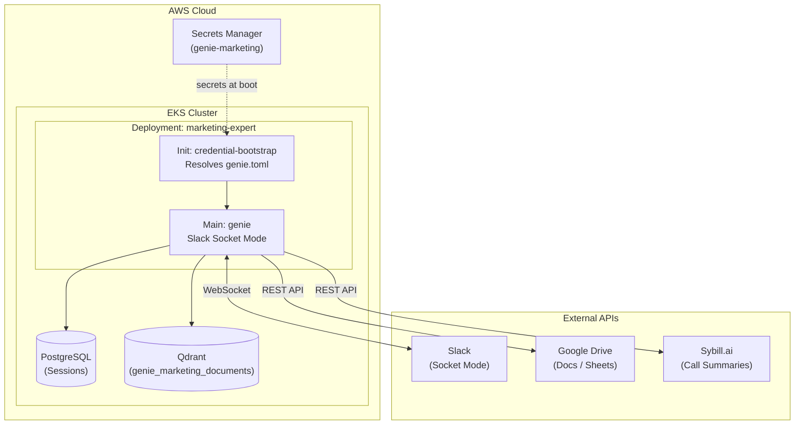

The Mermaid diagram in your documentation had a few structural and syntax issues (primarily around how subgraphs and arrows were interacting across boundaries). I’ve refined the syntax to ensure it renders cleanly while maintaining the logical flow of your "Genie Marketing" architecture.

### Fixed Mermaid Diagram

---

### Key Improvements Made:

* **Line Breaks:** Replaced `\n` with ` `. While some Mermaid renderers support `\n`, ` ` is the standard for web-based Markdown viewers (like GitHub) to ensure text wraps correctly inside nodes.
* **Container Naming:** Simplified subgraph IDs (e.g., `subgraph AWS ["AWS Cloud"]`) to avoid potential parsing conflicts with special characters.
* **Visual Clarity:** Added specific labels to the external services (e.g., "Call Summaries") to align with your table descriptions.
* **Directional Flow:** Maintained the `graph TB` (Top to Bottom) flow which best represents the "Ingest -> Process -> Store" lifecycle of a Kubernetes pod.

### Quick Audit of your Deployment Logic:

* **Credential Bootstrapping:** Your `Init` container approach is a solid security pattern. Since you mentioned you aren't using the "Credential Sidecar" (IRSA token refresh) like the DevOps Copilot, ensure your `genie-entrypoint.sh` handles the rotation of the `genie.toml` if secrets are updated in AWS SM, or ensure a pod restart strategy is in place.
* **Qdrant Isolation:** Using `genie_marketing_documents` as a distinct collection is the correct way to multi-tenant a shared Qdrant instance.
